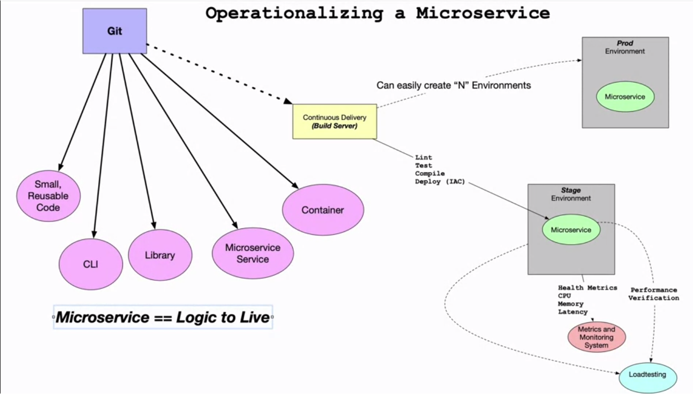
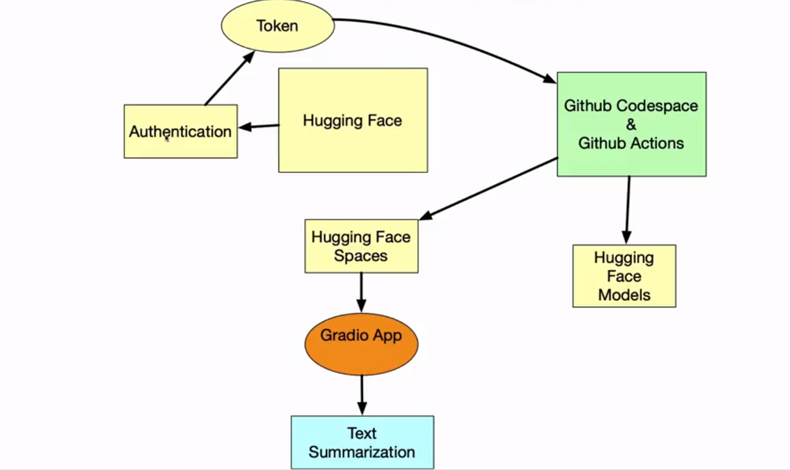

# Foundations of End to End MLOps with Web Apps and Microservices

## Operationalising a Microservice


# CI for Microservices
The ability to test, lint and format code each time code is committed to the repository.


Using github as an example, a .github folder is created, with an actions file, usually yml based. Inside the file contains a list of actions to perform when a particular defined event happens.

# MLOps Workflow
An example of a workflow recipe using Hugging Face:


1. Create a user account at hugging face
2. Create a new space
3. Select Gradio SDK
4. Clone the repository
5. Create codespace
6. Build a structure for the project. Create:
   1. Virtual environment
   2. Source environment for .bashrc
   3. requirements.txt
   4. Makefile
7. The main test code could look like this:

```
from transformers import pipeline
import gradio as gr

mode = pipeline("summarisation")

def predict(prompt):
    summary = model(prompt)[0]["summary.txt]
    return summary

with gr.Blocks() as demo:
    textbox = gr.Trextbox(placeholder="Enter text block to summarise", lines=4)
    gr.Interface=(fn=predict, inputs=textbox, outputs="text)

demo.launch()
```

8. Create action in github using huggingface token (Secrets -> Actions -> New Secret)
9. Create `.github/workflows/main.yml` actions
10. Huggingface environment needs an app configured in the space.

# App Runner Example
An example for AWS App Runner using FastAPI can be found in the FastAPI folder.
[Original location on github](https://github.com/noahgift/fastapi).

# Flask Example
An example can be found in the `flask-random-fruit` folder.

[Original location on github](https://github.com/noahgift/github-actions-pytest).

# Golang Example
1. Set up the project
2. Activate the cloud shell
3. Run: `gcloud app deploy`
4. Access using: `gcloud app browse`
5. View the logs: `gcloud app logs --tail`

A template can be found [here](https://github.com/nogibjj/go-template).

# Getting started with Makefile
The `Makefile` (always use capital `M`) contains steps for the make process.


```
hello:
    echo "this is my first make command
    
install:
    echo this wil later be a pip install command
```

Running the command:

``` make hello```

Will run the `hello` section of the Makefile. Add, commit an push to the git repository to allow for cloud based actions.


# Important Python Files
- Maker; automate the install, lint or deployment steps
- Docker; attach the runtime to a container
- requirements.txt; pin a version to a particular library


<br>

# Additional Reading
[Build a Web Application with Flask](https://paiml.com/docs/home/books/minimal-python/chapter06-build-web-apps-flask/)

[MLOps for Azure](https://learn.microsoft.com/en-us/azure/cloud-adoption-framework/manage/mlops-machine-learning)

[Introduction to Microservices](https://www.nginx.com/blog/introduction-to-microservices/)

[Building a Go App on App Engine](https://cloud.google.com/appengine/docs/standard/go/building-app)

[Getting Started with App Runner](https://docs.aws.amazon.com/apprunner/latest/dg/getting-started.html)

[Learn Github Actions](https://docs.github.com/en/actions/learn-github-actions/understanding-github-actions)