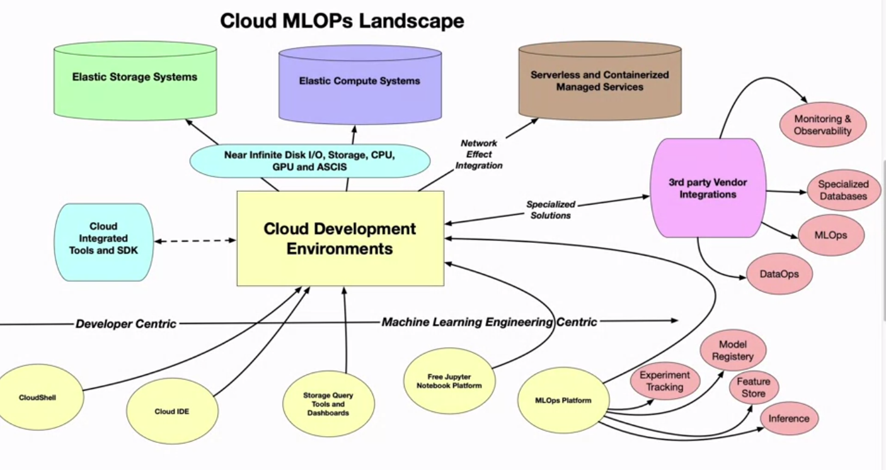
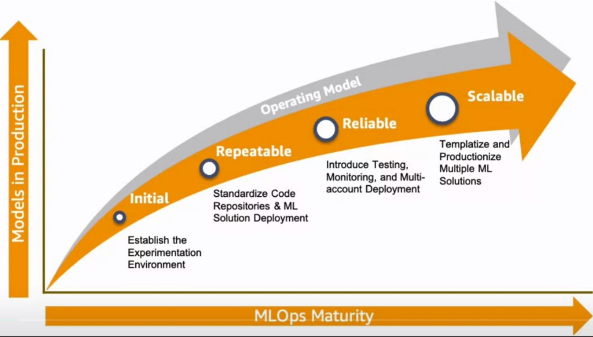
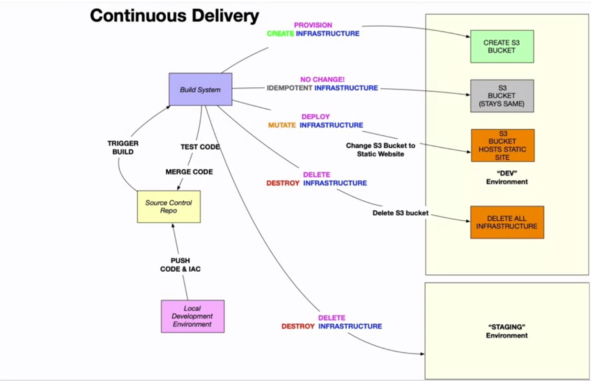
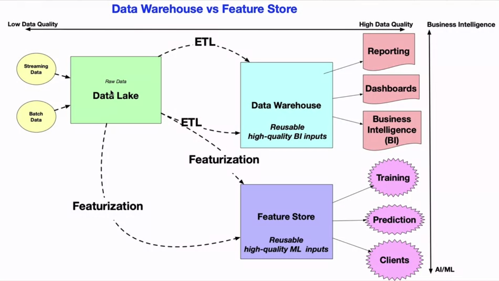

# Key concepts

Considering maturity models:

Key points in the models:
* DevOps but not MLOps
  * Data Team for every new model, limited feedback on model use
  * Difficult to repoduce results
* Automated Training
  * Training environment is fully managed
  * Easy to reproduce model
  * Releases are manual but low friction
* Automated Model deployment
  * Releases are low friction and automatic
  * Full traceability from deployment back to original data
  * Entire environment managed: train > test > production
* Full MLOps and Automated Operations
  * Full system automated and easily monitored
  * Production systems are providing information on improements and sometimes act on improvements
  * Approaching a zero-downtime system

# What is Continuous Integration?
DevOps - Is the ability to test your code.
CI - Ability to know whether the code works! (In a nutshell).
Continuous Delivery - Ability to reproduce and replicate into production and cloud environment.

A heap of examples can be found here:
https://github.com/noahgift/pytest-tips-tricks

## Getting started
- Get a cloud solution (such as github)
- Set up local virtual environment (in python use venv, Set it up in a hidden directory)
  - gitignore;  to ensure the virtual environment  so the venv doesn't get uploaded along with your code
  - set up requirements file to install all required modules (pytest, lint, black, etc)
  - Set up a makefile (Automated install, test, format, package)
  
Make use of code testing such as pytest.
`Lint` your code to ensure code style guidelines are followed. `Black` is an alternative amongst many others.

Github actions can handle a lot of code requirements in the first part of the build pipeline.

A nicety is to add a github actions badge at the top of the readme.

# What is Continuous Delivery?
It is a system to use the infrastructure to define the system to make a change. This allows the idea of constant pushing of changes to the environment in an automated fashion, as well as allowing pushes to multiple environments at the same time.

# What is Data Drift?
If the data is constantly changing, then the predictive model won't be as accurate as it previously was. The model will need to be re-trained to ensure greater accuracy.

# Additional Reading

[Increase reliability in data science and machine learning projects with CircleCI](https://circleci.com/blog/increase-reliability-in-data-science-and-machine-learning-projects-with-circleci/)

[Machine Learning operations maturity model](https://learn.microsoft.com/en-us/azure/architecture/example-scenario/mlops/mlops-maturity-model?WT.mc_id=academic-0000-alfredodeza)

[DevOps tech: Continuous Delivery](https://cloud.google.com/architecture/devops/devops-tech-continuous-delivery)

[Detect data drift on datasets](https://learn.microsoft.com/en-us/azure/machine-learning/v1/how-to-monitor-datasets?tabs=python&view=azureml-api-1)

[Automate MLOps with SageMaker Projects](https://docs.aws.amazon.com/sagemaker/latest/dg/sagemaker-projects.html)

[Databricks Feature Store](https://learn.microsoft.com/en-us/azure/databricks/machine-learning/feature-store/)

