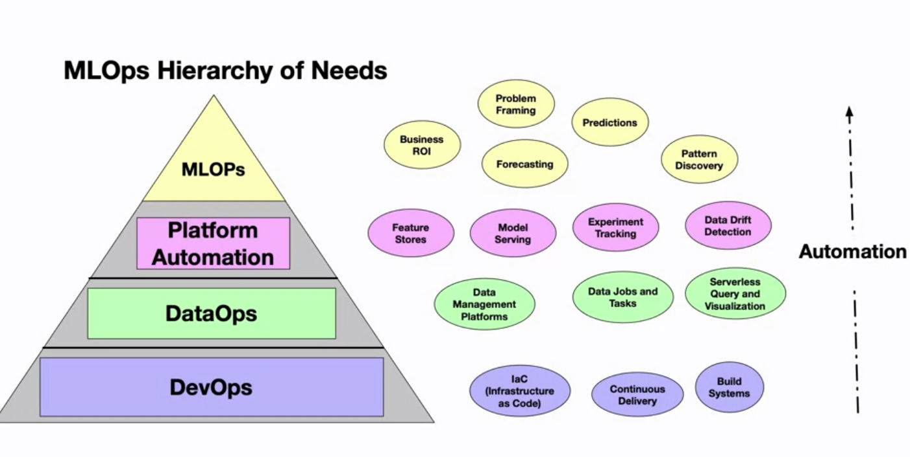
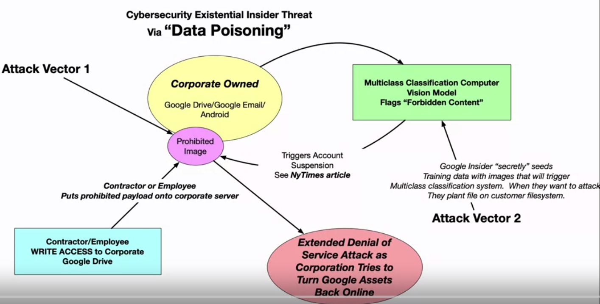

# MLOps intro

"25%" rule: 
You spend 25% of your time on:
* DevOps
* Data
* Modelling
* Business DE

If you can't articulate why you're trying to use machine learning, then it probably isn't a good fit!

Picking technology partners; there is no silver bullet for implementation.

Primary investment:
* Low cost
* Popular
* Easy to hire for
* Breadth
* Abstraction build ability
* Consider market leaders:
  * ability for market support (size of marketshare top to bottom: AWS, Azure, GCP, Alibaba, IBM cloud, etc)
  
Secondary:
* Does it solve the issue well
* Which platform (iguazio/databricks/splunk/snowflake)
* Maturity of platform:
  * specific aspect to make things easier (ETL, log searching, monitoring)
* Availability of certifications (ease of hire/training)
* Does it fit well with primary platform
* Use of popular tech (eg kubernetes)

Investments:
* R/D focus
* Tech innovation:
  * Deep learning
  * Kubernetes
  * Edge Computing
  * Pre-trained models (hugging-face, etc)
* Get subscriptions to learning platforms for access to certifications/knowledge. Key certifications:
  * AWS (Machine learning specialty, Data Analytics, Solutions Architect)
  * Snowpro
  * databricks certified
  * ML Run
  * Kubernetes certified
  * GCP Machine Learning Engineer

## MLOps future trends (as of 2020)
Here is a list of items that is predicted to happen in MLOps for the next few years (at least):
* Comeback of filesystem; NFS deployments with systems accessing same mount point
* Kuberetes and kubeflow workflows strengthen.
* Edge ML.
* ESG: sustainability in computing.
* Pre Trained Models: you don't need to build it to use it!
* Model portability, Eg XGBoost, scikit-learn, keras, tensorflow all can be used to input to universal format like ONNX.
* Concept of Kaizen (change and improvement, core concept of CI/DI devOps) ML. Automated process improvement such as automating testing, feature engineering, scaling; essentially everything feeding into a ML model to production to be automated.

Threats need to be addressed to identify and prevent data poisoning.

## Further Reading
[MLOps: Continuous delivery and automation pipelines in machine learning.](https://cloud.google.com/architecture/mlops-continuous-delivery-and-automation-pipelines-in-machine-learning#mlops_level_1_ml_pipeline_automation)

[What is DevOps?](https://www.atlassian.com/devops)

[Sowing the seeds of ethical AI: 4 tasks to stay on track](https://cloud.google.com/blog/transform/4-tasks-to-ensure-your-companys-ai-is-ethical)

[Build, test and Deploy ETL solutions using AWS Glue and AWS CDK](https://aws.amazon.com/blogs/big-data/build-test-and-deploy-etl-solutions-using-aws-glue-and-aws-cdk-based-ci-cd-pipelines/)