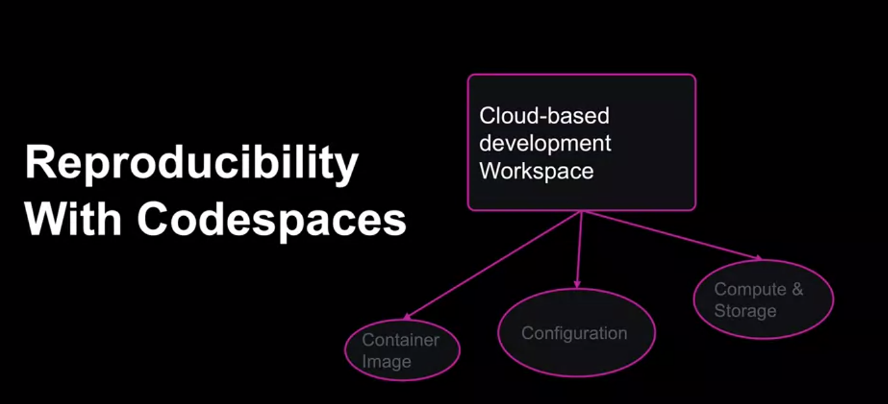
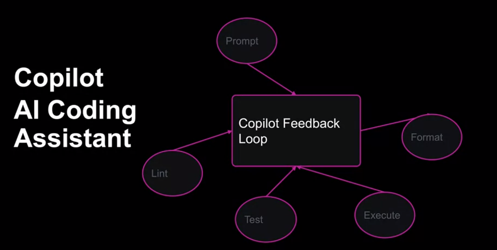
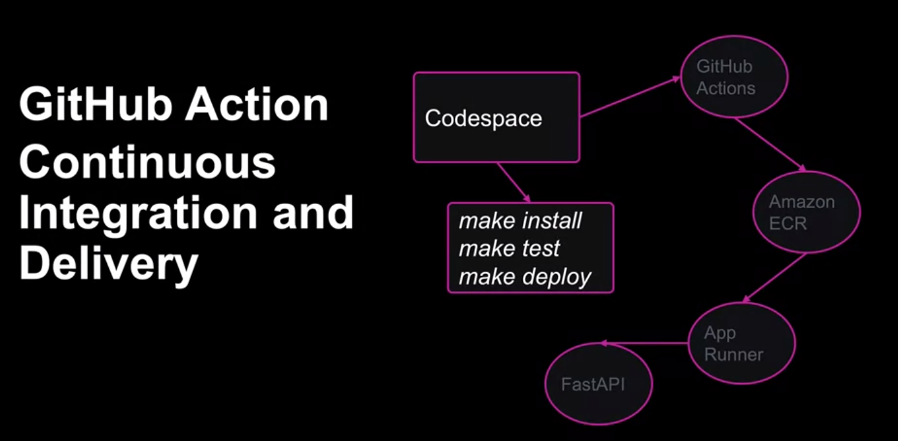

# Key Components of Github Ecosystems
- Reproducibility
- Access to GPU
- AI Coding Assistant (copilot)
- CI and DI (actions)

## Reproducibility
container image

## Access to GPU
- Hugging Face - pretrained models
- Pytorch
- Tensorflow
- Nvidia CUDA

## Copilot

## Github Actions

# Using Templates

Customise a workflow using this template:
https://github.com/microsoft/codespaces-teaching-template.py

After making modifications, you can set up the github repository to be a template for other people too!

# Github Codespaces
A Template can be found [here](https://github.com/nogibjj/mlops-template).

Create a codespace on the main branch. You can select a specific machine type for the codespace.
Prebuilt containers can be used to speed up the configuration, which helps when deploying multiple spaces often.

From here, you can configure Microsoft Code for the web and have a web based development environment without installing on the local machine.

# Hugging Face
There are over 75,000 models available from this service.

You can fine-tune a pretrained model, which is present on the site tutorials.

A github based tutorial can be found [here](https://github.com/nogibjj/hugging-face-tutorials).

# Additional Reading
[Scaling MLOps Education](https://github.com/readme/guides/mlops-education)

[Github Codespaces Overview](https://docs.github.com/en/codespaces/overview)

[Introduction to Github Dev Containers](https://docs.github.com/en/codespaces/setting-up-your-project-for-codespaces/adding-a-dev-container-configuration/introduction-to-dev-containers)

[Github MLOps Template](https://github.com/nogibjj/mlops-template)