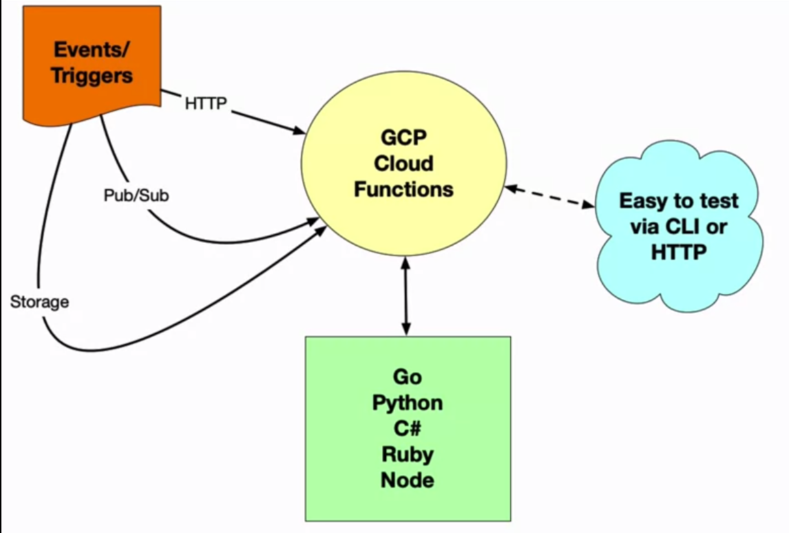
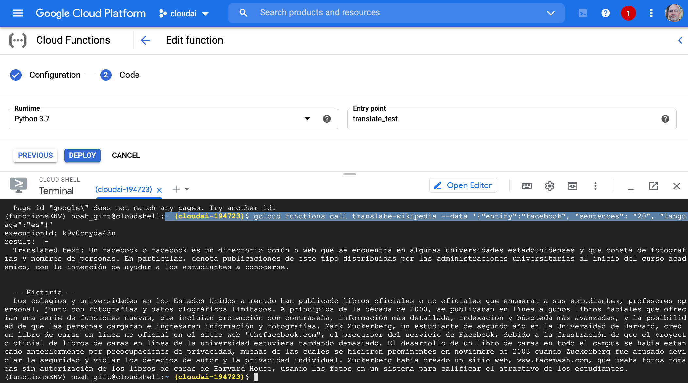

# Functions from Zero to Deploy

## Google Cloud Functions
A basic overview of the platform is as below:


From: https://github.com/noahgift/gcp-cloud-functions/tree/main
[YouTube Video](https://lnkd.in/eteHWVw7)

[O'Reilly Video](https://lnkd.in/eQ2YCjq)

Ensure the cloud shell is authorised!
```
gcloud auth list
```

Example payload from CLI:
```
gcloud functions call translate-wikipedia --data '{"entity":"facebook", "sentences": "20", "langu
age":"es"}'
```



# Additional Reading
[Create Functions](https://paiml.com/docs/home/books/minimal-python/chapter03-create-functions/)

[Introduction to Azure Functions](https://learn.microsoft.com/en-us/azure/azure-functions/functions-overview)

[GitHub project for Azure Functions in Rust](https://github.com/alfredodeza/rust-azure-function)

[Developing Event-Driven Serverless](https://docs.google.com/presentation/d/1lAa88cZrYjrC1cnj-rwgiintsK9HO16R/edit#slide=id.p1)

[Python Fire CLI Framework](https://github.com/google/python-fire)