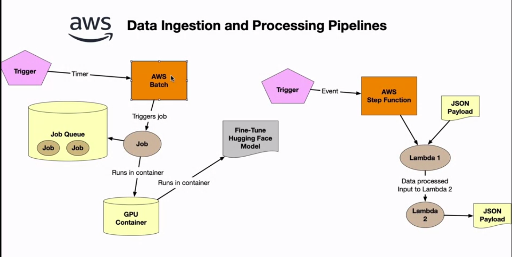
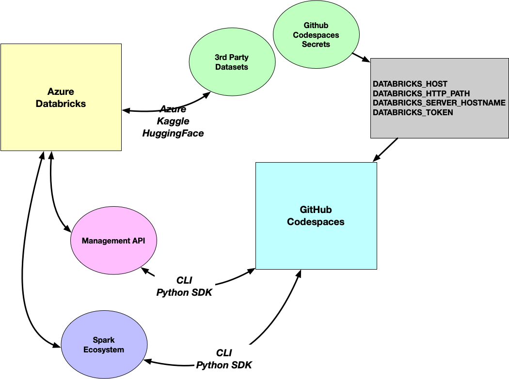
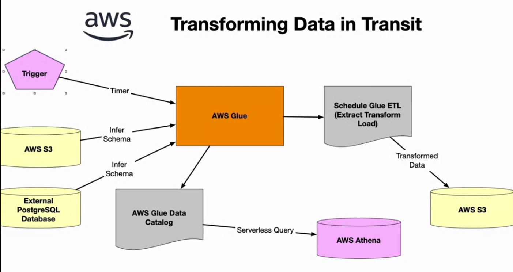
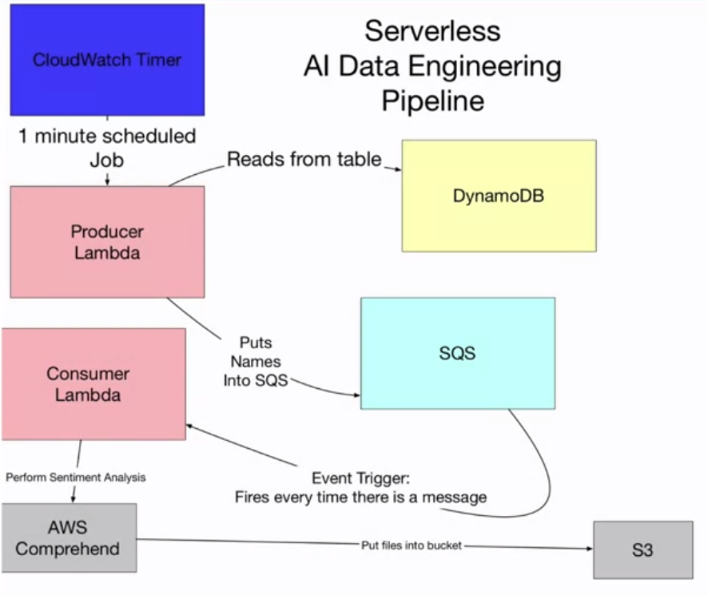

# AWS Lambda Functions

AWS Data Ingestion and Processing Pipeline

## AWS Step Functions
These functions are basically flow charts that are defined with JSON files.

## Azure Databricks
* Azure needs a cluster running with databricks to be able to connect the data processes.
* Server hostname and http path is needed to run the pipelines.

API Flowchart:

[Databricks github example](https://github.com/nogibjj/assimilate-databricks).

## Transforming Data in Transit

## Serverless AI Data Engineering Pipeline

# Additional Reading
[Developing with Messaging Services](https://docs.google.com/presentation/d/1tvHVXe_cWSGeOKB84pCCfMsm4_OlLOj_/edit#slide=id.p1)

[Databricks Utilities](https://docs.databricks.com/dev-tools/databricks-utils.html#file-system-utility-dbutilsfs)

[Serverless Reference Architecture: Real-Time File Processing](https://github.com/aws-samples/lambda-refarch-fileprocessing)

[AWS CDK Examples](https://github.com/aws-samples/aws-cdk-examples)