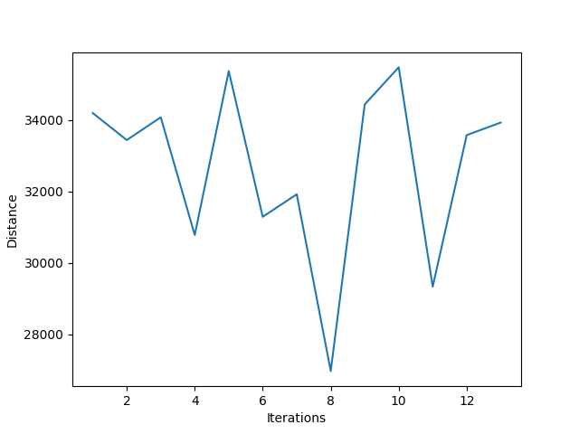

## Lab: Greedy Optimization

### Overview

In this lab, you will work with a greedy change command-line tool and a traveling salesman algorithm. You will modify the command-line tool, reflect on its robustness, and explore ways to enhance the scripts. 

### Goals

By the end of this lab, you will:

1. Understand how to modify command-line tools for improved robustness.
2. Learn how to enhance scripts for better performance and functionality.

### Tasks

#### A. Run the greedy change command-line tool

1. Run the greedy change command-line tool: `python greedy_coin.py 1.50`

2. Change the code to have a flag for dollars and flag for cents, i.e., `--dollars` and `--cents`.

**Reflection question:** Is this version of the command-line tool more robust against errors?
It's a little more robust as it now checks for the presence of cents.

**Reflection question:** What could you build to enhance this script? Do it and add it to your portfolio.
Here we can add checks for zero cents to prevent divide by zero errors.
Check for input value is a number.
No need to check for negative numbers, as Click treats that as an option. If this option is bypassed, then a negative number check should be performed.

#### B. Run the traveling salesman algorithm

1. Run the traveling salesman algorithm: `python tsp.py simulate`

2. What is the optimal number of simulations to run?
The optimum number appears to be 8.

