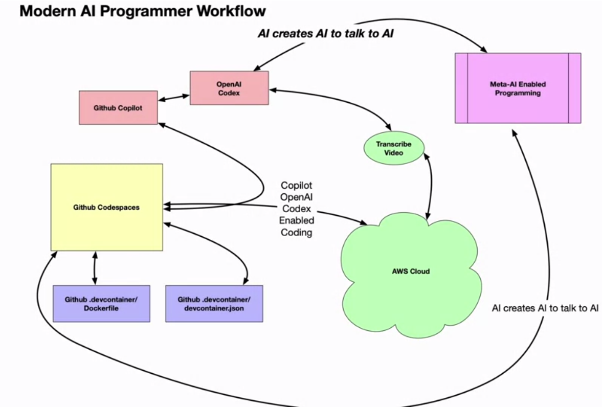

# Building End to End Solutions with AI

CoPilot makes heavy use of comments to provide context on what you are trying to code.

Adjusting these comments, or prompts, will change the suggestions made.

# Additional Reading
[Github Copilot Documentation](https://docs.github.com/en/copilot)

[Working with Amazon CodeWhisperer by using AWD Cloud9](https://docs.aws.amazon.com/cloud9/latest/user-guide/codewhisperer.html)

[OpenAI Codex](https://platform.openai.com/docs/guides/code)

[GitHub Copilot Labs](https://githubnext.com/projects/copilot-labs)

[Codespaces: Template repository with a working example](https://github.com/education/codespaces-project-template-py)