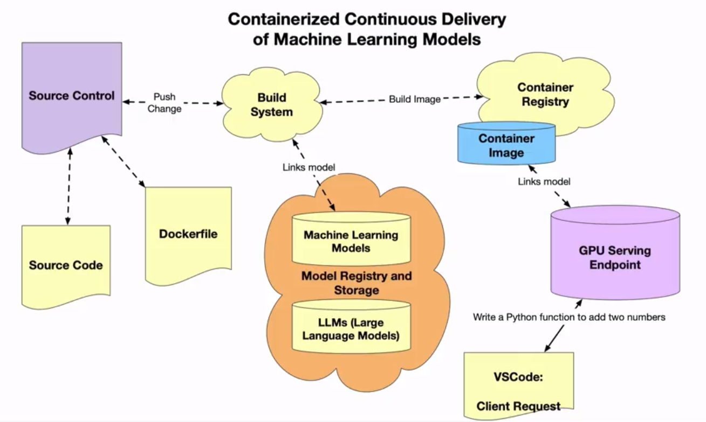

# Containers for Machine Learning

# Additional Reading

[Vitrualisation and Elasticity](https://paiml.com/docs/home/books/cloud-computing-for-data/chapter03-virtualization-containers-elasticity/)

["Distroless" Container Images](https://github.com/GoogleContainerTools/distroless)

[Example GitHub project with Rust Distroless](https://github.com/alfredodeza/rust-distroless-azure)

[Creating a container image for use on Amazon ECS](https://docs.aws.amazon.com/AmazonECS/latest/developerguide/create-container-image.html)

[Azure Functions with Rust](https://learn.microsoft.com/azure/azure-functions/create-first-function-vs-code-other?tabs=go%2Cmacos&WT.mc_id=academic-0000-alfredodeza)

[Introduction to Containers](https://docs.google.com/presentation/d/1uBlq4CMeQSffU3wwyU0xRrSR7buud20t/edit#slide=id.p1)