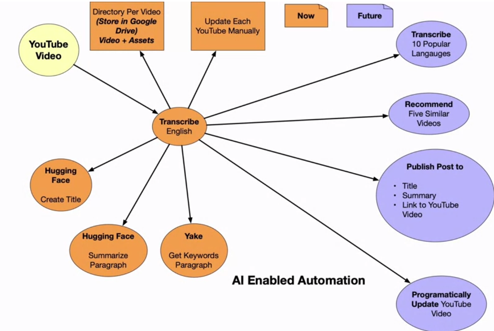
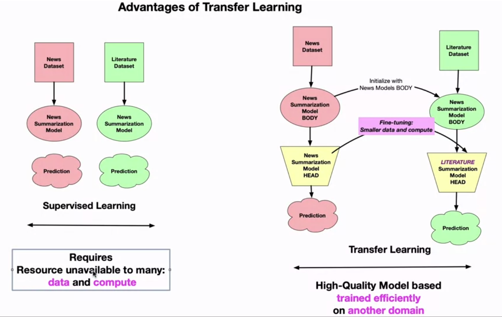

# Using AI to Build AI

AI Enabled Automation


# Prototyping AI APIs
Use bash or another scripting language to explore APIs before going to deep with programming your application!

In AWS Cloudshell, you can use the command:
```
aws comprehend detect-sentiment --language-code 'en' --text "I love C#."
```

## Use lynx to dump text

You can also use lynx to go further.

```
sudo yum install lynx
```

Next, dump the page for Albert Enstein and pipe it into less to explore it.
```
lynx -dump https://en.wikipedia.org/wiki/Albert_Einstein | less

```
By using wc -l we get a count of the lines:
```
lynx -dump https://en.wikipedia.org/wiki/Albert_Einstein | wc -l
```
To get the amount of bytes we can use wc --bytes:
```
lynx -dump https://en.wikipedia.org/wiki/Albert_Einstein | wc --bytes 432232
```
Because the AWS command-line tool only accepts up to 5000 bytes, we need to truncate the output.

```
[cloudshell-user@ip-10 ~]$ aws comprehend detect-sentiment --language-code "en" --text "$TEXT"
{
    "Sentiment": "NEUTRAL",
    "SentimentScore": {
        "Positive": 0.3402811586856842,
        "Negative": 0.0033634265419095755,
        "Neutral": 0.6556956768035889,
        "Mixed": 0.0006596834864467382
    }
}
```
## Bash Command
Using the above commands with an assign, such as `TEXT = ` then we can use `$TEXT` to pipe into other commands.

## AWS Entity Extraction
Going further with Bash shell processing and AWS entity extraction

```
aws comprehend detect-entities \
    --language-code "en" \
    --text "$TEXT" \
    --output text | head
```

An example of a more complex pipeline:
```
aws comprehend detect-entities \
    --language-code "en" \
    --text "$TEXT" \
    --output text \
    | cut -f 5 \
    | tr -cd "[:alpha:][:space:]" \
    | tr ' [:upper:]' '\n[:lower:]' \
    | tr -s '\n' \
    | sort \
    | uniq -c \
    | sort -nr -k 1 \
    | head
```

# Transfer Learning


Allows for fine tuning on existing models, training the data on a different dataset domain, allowing for efficient learning.


# Additional Reading
[AI/ML For the rest of us](https://mailchi.mp/7d99a6267c97/ai-ml-qa)

[Generative Adversarial Networks](https://developers.google.com/machine-learning/gan)

[Introduction to Open AI](https://platform.openai.com/docs/introduction)

[Transfer learning and fine tuning](https://www.tensorflow.org/tutorials/images/transfer_learning):
This tutorial introduces transfer learning for image classification using a pre-trained neural network. Transfer learning involves using a model previously trained on a large dataset (often for image classification) and adapting it for a specific task. The idea is that a model trained on a large, general dataset can serve as a generic visual world model, and its learned feature maps can be leveraged without training a new model from scratch. The tutorial demonstrates how to classify images of cats and dogs using transfer learning from a pre-trained network, either by using the model as-is or by fine-tuning it for the task.